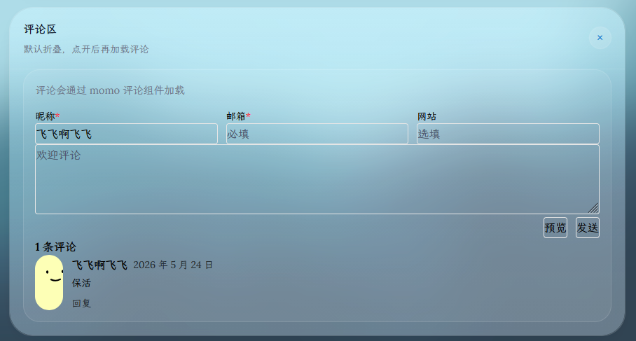

# Momo Backend Worker

Cloudflare Worker 版本基于 Cloudflare Workers + D1 + KV 实现，无需服务器即可部署运行。

## 部署条件

* 拥有一个 Cloudflare 账号（使用邮箱即可注册，[官网地址](https://www.cloudflare.com/)）
* 拥有一个 Node.js 运行环境，版本 >= 22（本地部署需要）
* 拥有一个域名并托管在 Cloudflare 上（这个不是必须项，但可以提高国内访问速度，也更方便）

## 部署

目前提供两种部署方式：1. [一键部署](#一键部署) 2. [本地部署](#本地部署)。

一键部署不需要 Node.js 环境，所有操作在操作面板上完成，操作过程可能会稍微复杂一点；本地部署需要用于 Node.js 环境，但是大部分配置都可以使用命令行完成，操作相对更加简单，也方便后期二次开发。可以根据自己的需求进行选择。

### 一键部署

#### 点击下方按钮进行部署

[](https://deploy.workers.cloudflare.com/?url=https://github.com/Motues/Momo-Backend/tree/main/worker)

注意：如果没有绑定Github账号的，可能需要进行一下绑定。

#### 填写信息

根据自己的需求填写需要的信息，这里的环境变量可以先不修改，等之后在设置中修改。

填写完成后下滑，点击 `创建和部署` 按钮。


#### 绑定 D1 和 KV

等构建完成后进入如下页面，点击中间的 `添加绑定` 按钮，进行数据库的绑定。


首先绑定数据库，左侧选择 `D1数据库`，然后点击右下角的添加绑定。然后需要设置数据库的相关信息，这里变量名称一定要填写为 `MOMO_DB`，数据库可以选择已有的，或者创建一个新的。完成之后点击右下角的 `添加绑定` 按钮。


创建之后我们点击该数据库，进入管理页面；点击左上方选项卡中的 `控制台` 选项，并分别执行下面三条的 SQL 语句，创建表结构。

```sql
CREATE TABLE IF NOT EXISTS Comment (
    id INTEGER PRIMARY KEY AUTOINCREMENT,
    pub_date DATETIME DEFAULT CURRENT_TIMESTAMP,
    post_slug TEXT NOT NULL,
    author TEXT NOT NULL,
    email TEXT NOT NULL,
    url TEXT,
    ip_address TEXT,
    device TEXT,
    os TEXT,
    browser TEXT,
    user_agent TEXT,
    content_text TEXT NOT NULL,
    content_html TEXT NOT NULL,
    parent_id INTEGER,
    status TEXT DEFAULT 'approved',
    FOREIGN KEY (parent_id) REFERENCES Comment (id) ON DELETE SET NULL
);
CREATE INDEX IF NOT EXISTS idx_post_slug ON Comment(post_slug);
CREATE INDEX IF NOT EXISTS idx_status ON Comment(status);
```


KV 命名空间的绑定与数据类似。左侧选择 `KV命名空间`，然后点击右下角的添加绑定。这里的变量名称一定要填写为 `MOMO_AUTH_KV`，KV 选择已有的，或者创建一个新的。完成之后点击右下角的 `添加绑定` 按钮。


#### 设置环境变量

回到面板首页，点击左上方选项卡中的 `设置` 选项，进入设置页面。我们可以看见变量和机密一栏，已经存在一些环境变量，可以点击编辑进行批量修改。这里可以[参考](#环境变量)下面的表格修改环境变量。对于不使用的环境变量，请删除，以免出现不确定的错误。

注意：尽量不要使用默认的管理员名称和密码。


#### 检测部署情况

最后访问 `域和路由` 中提供的域名，一般格式为`https://<your-progect-name>.xxx.workers.dev`，返回如下的管理页面。我们需要将接口地址改为当前的后端地址，用户名和密码填写为管理员名称和密码。

如果成功进入后台则表示部署成功。


### 本地部署

#### 下载代码，安装依赖

[克隆安装](# **克隆仓库** 安装)，或者 [Release 方式安装](#release 版本部署)，这里推荐选择后面一种。

#### release 版本部署

* **从 Release 下载代码**，可以使用命令行，也可以浏览器直接[下载](https://github.com/Motues/Momo-Backend/releases/latest/download/worker.zip)然后解压

 ```bash
 wget https://github.com/Motues/Momo-Backend/releases/latest/download/worker.zip
 unzip worker.zip
 cd worker
 pnpm install
 ```

[回到D1与Kv配置](#配置cloudflare-workers)

* **部署上线**

 ```bash
 pnpm run deploy
 ```

没有异常报错后，可以进入Cloudflare Workers 面板查看是否部署成功，若显示存在一个名称为 `momo-backend-worker` 的项目即推送成功。

[检测部署情况](#检测部署情况)

#### **克隆仓库** 安装

 ```bash
 git clone https://github.com/Motues/Momo-Backend.git
 cd Momo-Backend/worker
 pnpm install
 ```

如果你选择克隆仓库的方式，则需要先编译后端管理页面的代码，位于 `/dashboard` 目录下。编译完成后，复制到 `./public` 目录下

```bash
pnpm build:dashboard

# 或者使用以下命令逐步执行
cd ../dashboard
pnpm install
pnpm build
cp -r ./dist ../worker/public
cd ../worker
```

##### 配置Cloudflare Workers

对于 D1 和 KV 配置，有两种方法，第一种是直接使用命令行配置，第二种是使用网页面板创建后填写配置文件，这里推荐使用第一种方法。如果想要使用之前 Cloudflare 上面已经创建的数据库，可以选择自行配置 `wrangler.jsonc` 文件。

下面介绍第一种方法。

* **登录到 Cloudflare**

 ```bash
 pnpm wrangler login
 ```

* **创建数据库和数据库表**，如果遇到提示，请按回车继续

 ```bash
 pnpm wrangler d1 create MOMO_DB
 pnpm wrangler d1 execute MOMO_DB --remote --file=./schemas/comment.sql
 ```

* **创建 KV 存储**，如果遇到提示，按回车继续

 ```bash
 pnpm wrangler kv namespace create MOMO_AUTH_KV
 ```

 运行完成后可以确认一下 `wrangler.jsonc` 中是否有如下配置

 ```jsonc
  "d1_databases": [
     {
         "binding": "MOMO_DB",
         "database_name": "MOMO_DB",
         "database_id": "xxxxxx" // D1 数据库 ID
     }
 ],
 "kv_namespaces": [
     {
         "binding": "MOMO_AUTH_KV",
         "id": "xxxxxxx" // KV 存储 ID
     }
 ]
 ```

* **部署上线**

 ```bash
 pnpm run deploy
 ```


* 本地测试

```bash
pnpm run dev
```

#### 检测部署情况

部署成功后回得到一个域名，即为后端的域名（格式一般为`https://momo-backend-worker.xxx.workers.dev`。

访问该域名，如果显示后端管理页面并可以正常登录则部署成功。**默认用户和密码均为`momo`，首次进入需要修改用户名和密码**，系统参数可以在右侧的系统参数中修改，可以参考[系统参数](parameter.md)。

将后端域名填写到博客的配置文件中即可使用评论功能。当然也可以使用自定义域名，注意不要使用三级域名，即`*.*.example.com`。

## [系统参数](parameter.md)

## [前端使用](../frontend/README.md)

可以使用前端提供的评论组件，js文件，导入到自己的网站中.


